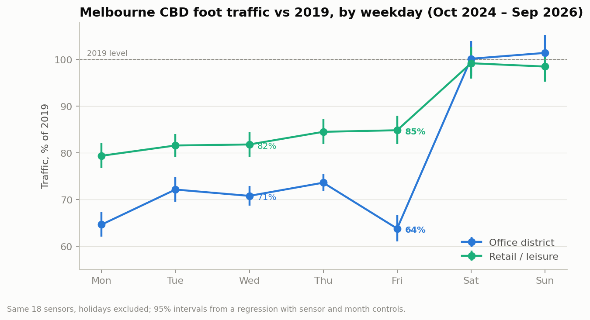

# Melbourne CBD Foot Traffic

**What drives foot traffic in Melbourne's CBD, and can it be predicted a day ahead?**

An end-to-end project on 17 years of hourly City of Melbourne pedestrian counts:
an automated data pipeline, a day-ahead forecast, and an analysis of how hybrid
work has reshaped the city's working week.

**Live dashboard:** _add your Streamlit link here_

## Key finding



**Weekends in the CBD are fully back to 2019 levels; weekdays are not.** In the
office district, Friday traffic is still **36% below 2019** and Monday 35% below,
while Wednesday is 29% below. In the morning commute (7–10am), Mondays and Fridays
are a further **17% (95% CI 15–19%)** behind mid-week. The gap is the same in
2024–25 and 2025–26, so it looks settled, not still closing. Shopping and leisure
areas show no such gap. [Full analysis →](notebooks/03_analysis.ipynb)

## Results at a glance

| Part | Result |
|---|---|
| **Pipeline** | 6.2 million hourly counts from 17 years of City of Melbourne sensor data, plus hourly weather, in DuckDB. Updated monthly by GitHub Actions. |
| **Forecast** | LightGBM day-ahead forecast cuts error by **25%** vs a seasonal baseline (WAPE 19.4% → 14.6%), tested month by month over a full year. It fails mostly on 41–43°C days and heavy rain. |
| **Analysis** | Hybrid-work pattern: Mon/Fri office-district traffic 64–65% of 2019 vs 71–74% Tue–Thu; weekends at 100%. |

## How it works

**1. Pipeline** ([`src/melbourne_foot_traffic/`](src/melbourne_foot_traffic))
- Downloads the council's 2009–2022 archive and its live table (two different
  formats), sensor locations, and hourly weather from Open-Meteo.
- Cleans them into typed DuckDB tables (`counts`, `sensors`, `weather`, `calendar`).
- Incremental: a re-run only fetches what's new, with retries for failed downloads.
- A [monthly GitHub Actions job](.github/workflows/update-data.yml) updates the
  database and publishes it as a release asset. This matters because the council's
  live table only keeps two years: the database is now the only copy of older data.

**2. Forecast** ([`notebooks/02_forecast.ipynb`](notebooks/02_forecast.ipynb))
- The council publishes counts monthly, so a real forecast can only use counts
  **at least 35 days old**. Every feature respects that, and a test checks it.
- Features: sensor, hour, weekday, public holidays, school terms, major events,
  weather, past counts, and a seasonal profile learned from 2014–2019.
- Validation: rolling monthly backtest (retrain, then predict the next unseen
  month) over Oct 2025 – Sep 2026. The set-up was chosen on an earlier period, so
  the test year was used only once.

**3. Analysis** ([`notebooks/03_analysis.ipynb`](notebooks/03_analysis.ipynb))
- 2019 vs Oct 2024 – Sep 2026, same 18 CBD sensors, public holidays and faulty
  sensor-days excluded.
- Regression on log daily counts with sensor and month controls and a
  weekday × period interaction; standard errors clustered by week.
- Robustness: holds for sensors with and without the 2023 hardware upgrade, in both
  recent years, and at 17 of 18 sensors.

## Data notes and limitations

- **Gaps:** Nov 2022 – Sep 2024 is not publicly available (the council's live table
  keeps a rolling two-year window). September 2010 is dropped: every hour in the
  archive is stamped as midnight.
- **Zeros vs missing:** a missing hour is treated as unknown, not zero; days where a
  sensor reports zero for every daytime hour are treated as faults.
- **Sensor changes:** sensors 6 and 47 are excluded (moved or changed what they
  count). Several sensors were upgraded in 2023, inside the data gap.
- **Causation:** the analysis shows a pattern consistent with hybrid work, not proof
  of its cause; shops, transport and population have also changed since 2019.
- **Weather in the forecast test** is observed weather; in real use it would be a
  forecast, so live error will be slightly higher.

## How to run

Requires [uv](https://docs.astral.sh/uv/) and Git.

```bash
git clone https://github.com/limpokaya/melbourne-foot-traffic.git
cd melbourne-foot-traffic
uv sync                                  # install everything
uv run melbourne-foot-traffic            # build the database (10-20 min the first time)
uv run pytest                            # run the tests
uv run jupyter lab                       # open the notebooks
uv run streamlit run app/app.py          # open the dashboard
```

To skip the first build, download `foot_traffic.duckdb` from the
[latest data release](https://github.com/limpokaya/melbourne-foot-traffic/releases/tag/data-latest)
into `data/`.

## Project structure

```
src/melbourne_foot_traffic/
    sources.py     download counts, sensors and weather
    db.py          clean and load into DuckDB
    events.py      holidays, school terms, events calendar
    pipeline.py    one command to build or update the database
    forecast.py    baseline, features, LightGBM, rolling backtest
    analysis.py    2019 vs recent weekday regression
notebooks/         01 explore, 02 forecast, 03 analysis
app/app.py         Streamlit dashboard
data/reference/    hand-made school term and event dates (with sources)
tests/             pytest: parsing, leakage checks, model sanity checks
docs/              README chart and write-up
```

## Sources

- City of Melbourne Open Data: Pedestrian Counting System (counts per hour) and Sensor Locations
- Open-Meteo historical weather and forecast APIs
- Victorian public holidays via the `holidays` package; school terms from vic.gov.au
